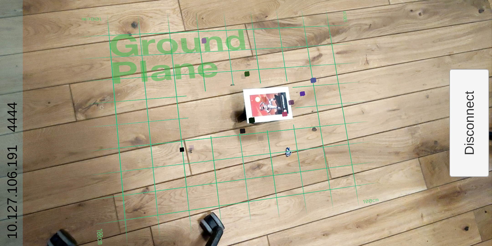

# Vehicle Detection Rendering in AR
A mobile client that can receive streamed (low fidelity) point cloud data and render it around a real vehicle or vehicle model in Augmented Reality

Using Qt, Unity and Vuforia

## Intro
This project includes a Mobile client developed in Unity (to be deployed on an Android device) and a TCP server application build in Qt that can run on a laptop. 

Supported (and tested) devices: 

Mobile Client: Google Pixel 3
Tcp Server App: MacBook Pro 15"

These applications have not been tested with other devices but *should* be able to run on other MacOS for server and Android devices supporting Vuforia for the client

Other projects used / referenced here:
https://github.com/dave-hillier/disruptor-unity3d/
https://riptutorial.com/qt/example/29873/tcp-client

## Why 
Being able to see sensor data around a real vehicle can be a very important tool for the development of autonomous vehicles (and other devices!). Using Augmented Reality - we can overlay a visualization of sensor detections into the real world. An engineer could see live if a sensor is getting false detections, or if a certain object is triggering detections or not (e.g. a pedestrian, animal, rock, etc.)

The idea behind this application is that the vehicle running the sensor server can also run the Tcp Server Application (QPointCloudPublisher) and stream point cloud data to any listening clients. 

A user can then run the client on a mobile device (or maybe in the future with AR headset) and be able to see the streamed detections. 

## What can it do now
Right now the Tcp Server is just generating random points to stream. There is a low bandwidth available due to streaming wirelessly and the decoding / rendering of the points on the mobile client

## Future Goals
I want to replace the random points with real data from a vehicle (e.g. http://robots.engin.umich.edu/SoftwareData/Ford). This would involve an LCM interface and processing of the Lidar or Radar points. 

I want to replace the float[] --> std::string --> byte[] serialization with Google Protocol Buffers (https://developers.google.com/protocol-buffers/). This will provide a more robust and extendable interface between client and server as well as improve performance (vs text based serialization)

There are several improvements on the rendering and data processing side of the mobile client: 
1. ECS / Jobify the processing - using Unity's Entity Component System , Job System, and burst compiler (https://unity.com/dots) we can greatly improve CPU load

2. GPU rendering of points. This will be a challenge as the mobnile client doesn't supported compute shaders - however the goal would be to use an instanced shader to directly render the points via the GPU (instead of instancing a GameObject for every point)

## Screenshots

  

